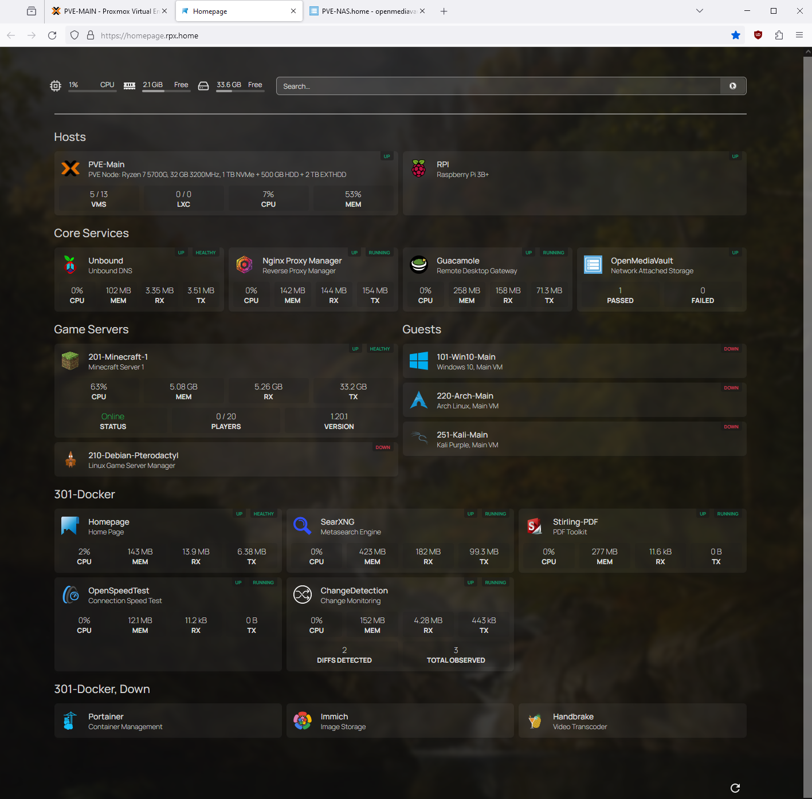

<h1 align=center> molofgarb </h1>

 Welcome to my profile! 

<h2> Active Projects: </h2>

<ul>
<li>
    <b><a href="https://github.com/molofgarb/nyc-subway-tracker/tree/dev">nyc-subway-tracker</a></b>
    : logs history of trains for all lines and all stations in the NYC subway system 
</li>
<li>
    <b><a href="https://github.com/molofgarb/ytdl-GUI/tree/dev">ytdl-GUI</a></b>
    : GUI program for <a href="https://github.com/yt-dlp/yt-dlp">yt-dlp</a>, a video downloader
</li>
<li>
    <b><a href="https://github.com/molofgarb/molofgarb-system-scripts">system-scripts</a></b>
    : a collection of system scripts that I use for my home server
</li>
</ul>

<h2> Projects on Hold: </h2>

<ul>
<li>
    <b><a>molofgarb.github.io</a></b>
    : personal website to showcase programming projects
    <ul>
        <li>Will be worked as more projects are completed</li>
    </ul>
</li>
<li>
    <b><a href="https://github.com/molofgarb/post-scriptum-mortar-tool">post-scriptum-mortar-tool</a></b>
    : calculates mortar inputs for Post Scriptum given current and target coordinates
    <ul>
        <li>Next step is to design a GUI for the program, but is not a high priority at the moment</li>
    </ul>
</li>
</ul>

<h2> Completed Projects: </h2>

<ul>
    <b><a href="https://github.com/molofgarb/tag-security-11">tag-security-11</a></b>
    : co-authored a security assessment draft of <a href="https://github.com/antrea-io/antrea">Antrea</a> for the CNCF Security Technical Advisory Group 
    
<li>
    <b><a href="https://github.com/molofgarb/molofgarb-laptop-deployment">molofgarb-laptop-deployment</a></b>
    : scripts used to simplify Windows laptop deployment
</li>
<li>
    <b><a href="https://github.com/molofgarb/rats-py">rats.py</a></b>
    : Final project for HS Intro to Programming class
</li>
</ul>    

<h2> Environments That I Use: </h2>
<ul>
<li>
    x86_64 (Desktop):
    <ul>
        <li>Windows 10 <a href="https://www.msys2.org/">MSYS2/MINGW64</a></li>
        <li>Windows 10 <a href="https://learn.microsoft.com/en-us/windows/wsl/install">WSL2</a>, <a href="https://wiki.archlinux.org/title/Arch_Linux">Arch Linux</a></li>
        <li><a href="https://wiki.archlinux.org/title/Arch_Linux">Arch Linux</a></li>
    </ul>
</li>
    
    
<li>
    Apple Silicon (Laptop):
    <ul>
        <li>macOS</li>
        <li><a href="https://asahilinux.org/">Asahi Linux</a> (<a href="https://www.fedoraproject.org/">Fedora</a>)</li>
    </ul>
</li>

<li>
    Proxmox VE (Server Host):
    <ul>
        <li>Windows 10, Windows 2022 Server</li>
        <li>Arch Linux, Debian</li>
    </ul>
</li>

<h2>My Home Services:</h2>

</ul>
